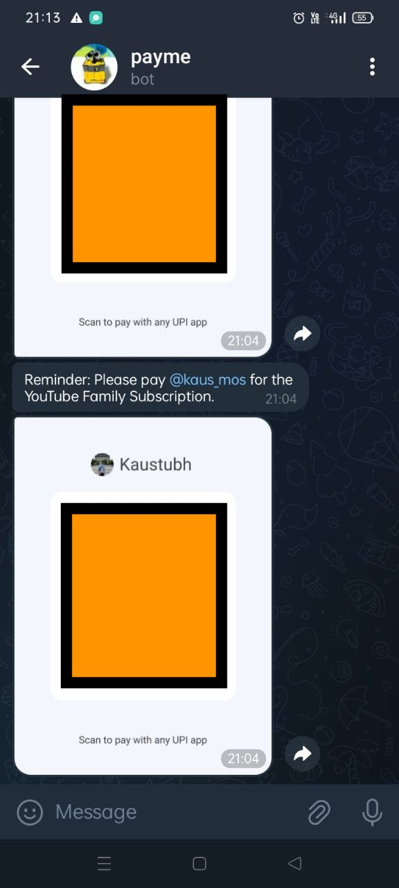

## Payme
A Python-based Telegram bot that sends automated reminders in telegram to friends on the 23rd of every month at 9 AM to remind them of paying for that one family subscription service we purchased as a group.
The bot uses apscheduler for scheduling
<div align="center">  </div>

### Features
- Sends scheduled reminders with a QR code attachment.
- Dynamically loads recipients from a JSON file.
- Configurable scheduling using apscheduler.
- Logging with color-coded outputs for better readability.

### Project Structure
```json
telegram-payment-bot/
├── bot/
│   ├── __init__.py              # Marks the directory as a Python package
│   ├── main.py                  # Main entry point for the bot
│   ├── scheduler.py             # Scheduler logic for reminders
│   ├── utils.py                 # Helper functions (e.g., loading recipients)
│   ├── logger.py                # Logging configuration
├── data/
│   ├── payment_qr.png           # QR code image to attach to reminders
│   ├── receivers.json           # JSON file containing recipient data
│   ├── receivers.example.json   # Example JSON file 
├── tests/
│   ├── test_scheduler.py        # Tests for scheduling logic
├── .env                         # Environment variables file
├── .gitignore                   # Ignored files and directories
├── requirements.txt             # Python dependencies
├── README.md                    # Documentation file

```

### Getting Started
#### 1. Prerequisites
Python 3.8 or higher
Telegram bot token (create a bot via BotFather)

#### 2. Installation
a. Clone the repository:

```bash
git clone https://github.com/your-username/telegram-reminder-bot.git
cd telegram-reminder-bot
```

b. Create a Python virtual environment:

```bash
python -m venv venv
source venv/bin/activate  # On Windows: venv\Scripts\activate
```

c. Install dependencies:

```bash
pip install -r requirements.txt
```

d. Set up the .env file: Create a .env file in the root directory and add:

```
TELEGRAM_TOKEN=<YOUR_TELEGRAM_BOT_TOKEN>
```

e. Update recipients.json: Add recipient chat IDs in data/recipients.json:

```json
{
    "@username1": "123456789",
    "@username2": "987654321"
}
```

#### 3. Usage
Start the bot:
```bash
python -m bot.main
```

#### 4. Demo
<div align="left">  </div>

### Default Behavior:
The bot will send reminders to all recipients on the 23rd of every month at 9 AM.
The reminder includes a predefined message and the attached QR code.